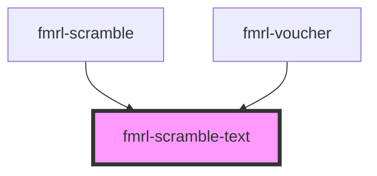

# fmrl-scramble-text

<!-- Auto Generated Below -->

## Properties

| Property    | Attribute    | Description | Type                         | Default     |
| ----------- | ------------ | ----------- | ---------------------------- | ----------- |
| `heading`   | `heading`    |             | `1 \| 2 \| 3 \| 4 \| 5 \| 6` | `undefined` |
| `startText` | `start-with` |             | `string`                     | `undefined` |
| `text`      | `text`       |             | `string`                     | `undefined` |

## Events

| Event          | Description | Type               |
| -------------- | ----------- | ------------------ |
| `scrambleDone` |             | `CustomEvent<any>` |

## Dependencies

### Used by

 - [fmrl-scramble](../fmrl-scramble)
 - [fmrl-voucher](../fmrl-voucher)

### Graph

----------------------------------------------

*Built with [StencilJS](https://stenciljs.com/)*
