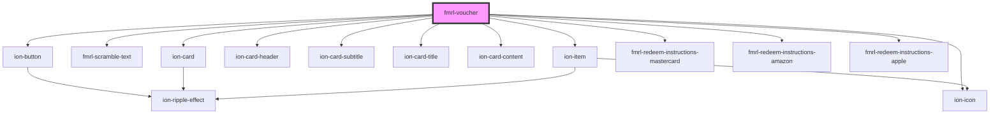

# fmrl-voucher

<!-- Auto Generated Below -->

## Properties

| Property    | Attribute   | Description | Type                                             | Default     |
| ----------- | ----------- | ----------- | ------------------------------------------------ | ----------- |
| `amount`    | `amount`    |             | `string`                                         | `undefined` |
| `code`      | `code`      |             | `string`                                         | `undefined` |
| `encrypted` | `encrypted` |             | `boolean`                                        | `undefined` |
| `hint`      | `hint`      |             | `string`                                         | `undefined` |
| `link`      | `link`      |             | `string`                                         | `undefined` |
| `type`      | `type`      |             | `"amazon" \| "apple" \| "mastercard" \| "other"` | `undefined` |

## Dependencies

### Depends on

- ion-button
- [fmrl-scramble-text](../fmrl-scramble-text)
- ion-card
- ion-card-header
- ion-card-subtitle
- ion-card-title
- ion-card-content
- ion-item
- ion-icon
- [fmrl-redeem-instructions-mastercard](../fmrl-redeem-instructions-mastercard)
- [fmrl-redeem-instructions-amazon](../fmrl-redeem-instructions-amazon)
- [fmrl-redeem-instructions-apple](../fmrl-redeem-instructions-apple)

### Graph

----------------------------------------------

*Built with [StencilJS](https://stenciljs.com/)*
